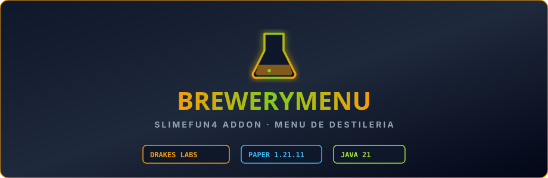

  

# BreweryMenu

Addon de integración para **Slimefun 4** y **BreweryX** que expone las recetas de destilería, fermentación, añejamiento y bebidas artesanales directamente en la Guía Interactiva de Slimefun (`/sf guide`). Portado, limpiado de chino y mantenido por **DrakesCraft Labs** para Paper/Purpur 1.21.11 en Java 21.

---

## 🎯 Objetivo

Permitir a los jugadores consultar cómodamente los ingredientes, tiempos de cocción, tipos de barricas y años de añejamiento de todas las bebidas de BreweryX sin salir de la interfaz visual de Slimefun.

---

## ⚡ Características Principales

- **Categoría Visual en la Guía Slimefun**:
  - Menú interactivo con iconos de botellas, barriles y calderos.
- **Detalle de Receta Completo**:
  - Ingredientes exactos, pasos de fermentación y tipos de madera requeridos para el añejamiento óptimo.
- **Sincronización Automática**:
  - Lee las recetas configuradas en `BreweryX` para mostrarlas de forma fiel y actualizada.

---

## 🛠️ Entorno y Compatibilidad

- **Servidor**: Paper / Purpur 1.21.11
- **Java**: 21
- **Dependencias**:
  - `Slimefun4-Drake`
  - `BreweryX-Drake`

---

## 📜 Créditos y Origen

- **Autor original**: Comunidad Slimefun
- **Adaptación y Mantenimiento 1.21.11**: **DrakesCraft Labs**
